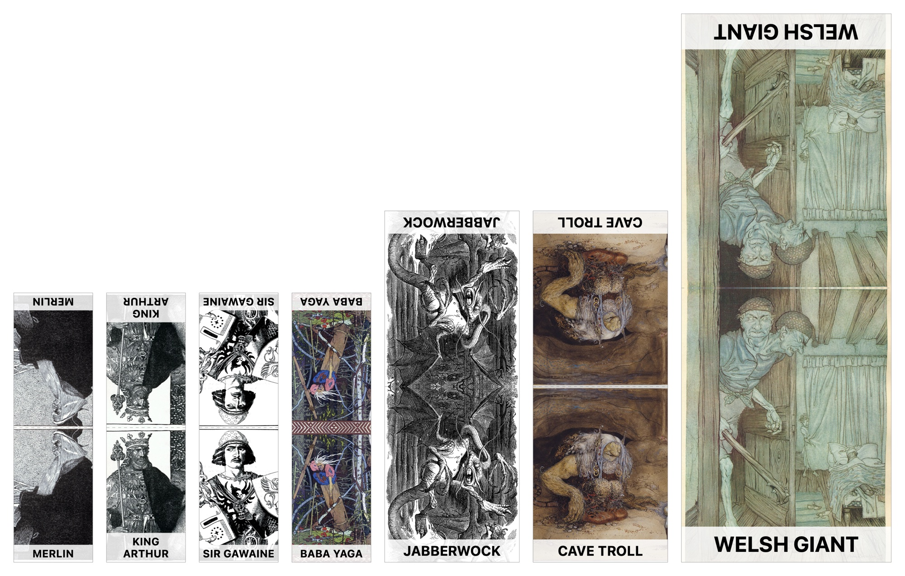
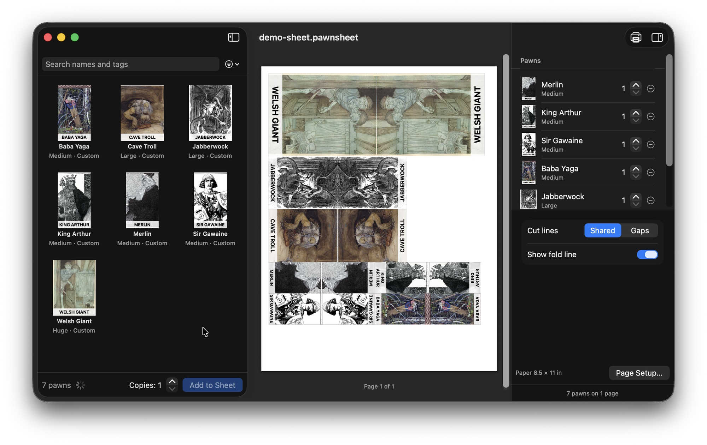

# Pawn Shop

[](https://github.com/scooper4711/pawn-shop/actions/workflows/ci.yml)
[](https://sonarcloud.io/summary/new_code?id=scooper4711_pawn-shop)
[](https://sonarcloud.io/summary/new_code?id=scooper4711_pawn-shop)
[](https://github.com/scooper4711/pawn-shop/releases)
[](https://github.com/scooper4711/pawn-shop/releases)
[](#requirements)
[](./LICENSE)

An unofficial Mac app for printing the pawns from your Paizo pawn PDFs, for Pathfinder and Starfinder,
without duplex printing.

Paizo's pawn PDFs put each pawn's back on the next page, mirrored, which rarely lines up when printed on
both sides, and a single sheet makes a floppy pawn. Needing six goblins means printing the goblins' whole page
six times, along with every other pawn on it, and wasting a lot of paper. And sometimes there is no pawn for the
creature you want at all, because it only appears as art in a Pathfinder or Starfinder scenario or a newer book.

Pawn Shop collects the pawns from those PDFs into a library and prints only the pawns you choose, as many of
each as you need, each as one strip on one side of the paper: the front below, the back above it turned upside
down, head to head. Cut the strip out and fold it at the heads: the pawn is two sheets thick, and a pawn base
holds both ([printable bases](#pawn-bases) come with the app). For a creature without a pawn, make your own
from any picture, such as the art from a scenario PDF, which [Pluck](https://github.com/scooper4711/pluck)
gets out for you.

Paizo's newer round tokens become pawns too, so a token box gives you folding pawns rather than flat
discs. So do Paizo's Battle Cards: if you have a deck of them, with or without the pawns, each card's creature
becomes a pawn. Where a pawn box prints the same painting, the pawn uses the card's art, which is usually
several times sharper, and every creature from a card can be found by its traits, such as undead or construct.

It is free, and it works only with PDFs you bought: the app contains no Paizo art itself.



*Printed strips: fold each at the heads and stand it in a pawn base. These are custom pawns made from
public-domain illustrations (see [Sample art](#sample-art)); Paizo's pawns print the same way.*



*The library on the left, the sheet as it will print in the middle, and the sheet's pawns and cut style on
the right.*

## Features

- Imports every pawn, token and Battle Cards PDF that
  [Scrollkeeper](https://github.com/scooper4711/scrollkeeper) has downloaded in one go, or any PDF you choose
  or drop on a window.
- Finds each pawn from its cut outline, names it from its label, sizes it (small, medium, large, huge) and
  turns it upright. Pawns printed on their side, with backs on the following page or with no back page at
  all, are handled.
- Turns round tokens into pawns: the token's art alone, without the page background, the cut line or the
  name printed on it, above the pawn's name on white. Tokens are named from the label on their back page or
  the name along their rim, and sized from the token (1" medium, 2" large, 3" huge).
- Turns Battle Cards into pawns: each card's creature alone, from the art side, standing above its name on
  white, named and sized from the stat side, with its traits (rarity and alignment left out) to search on.
  Decks in one PDF or in two (fronts and backs) are both read, for Pathfinder and Starfinder.
- Uses the sharpest art it has: a pawn whose painting a deck of Battle Cards also prints is drawn from the
  card, and a card already in the library keeps its art when the pawn box comes later.
- Stores copies of the same art once, also when another product reprints them, and keeps pawns that share
  a name but not their art (first and second edition, variants) side by side so you can pick.
- Search by name, product, trait or what the art shows, and filter by size, game, product or your own pawns.
- Optional tagging by a vision model running on your Mac in [Ollama](https://ollama.com), which describes
  each pawn's art in keywords such as "woman, warrior, shield, scimitar" and suggests names for pawns printed
  without one.
- Sheets are documents: add pawns with a number of copies, see the pages as they will print, and save the
  sheet to print again later. Strips are packed upright or on their side, whichever needs fewer pages.
- Cut lines shared between strips (one cut separates two pawns) or gaps between them, and an optional fold
  line.
- Optional room for a base: blank paper below each face's foot, so the base's slot holds that instead of
  hiding the bottom of the name. The art keeps its size and the strip gets taller.
- Custom pawns from your own images, from small to gargantuan.
- Tells you when a new version is released, if you like: it checks when it opens (turn that off in Settings)
  and on Pawn Shop › Check for Updates….

## Requirements

macOS 15 or later. You need the pawn PDFs themselves: buy them from [paizo.com](https://paizo.com) and
download them from your account, or let [Scrollkeeper](https://github.com/scooper4711/scrollkeeper), a
library manager for your Paizo purchases, download them.

## Installing a release

Download the disk image from the [releases page](https://github.com/scooper4711/pawn-shop/releases), open
it and drag Pawn Shop to Applications.

The app is not notarized by Apple, so macOS blocks it the first time:

1. Open Pawn Shop once. macOS says it cannot be opened; click Done.
2. Open System Settings › Privacy & Security and scroll down to the message about Pawn Shop.
3. Click Open Anyway and confirm.

After that it opens normally.

## Using Pawn Shop

- **Import:** Library › Import from Scrollkeeper imports every pawn, token and Battle Cards PDF that
  [Scrollkeeper](https://github.com/scooper4711/scrollkeeper)
  downloaded and that is not in the library yet. Library › Import PDF… (⇧⌘I), or dropping PDFs on a window,
  imports others. The import summary lists the pawns added, the pawns that now use sharper art from Battle
  Cards, and any PDF where nothing was found. A PDF whose file name does not mention Starfinder counts as
  Pathfinder, so rename such a file before importing it. Battle Cards are recognized by "Battle Cards" in the
  file or folder name; for a deck in two PDFs (FRONT and BACKS), import either one and the other is read too.
- **Find:** search by name, product, trait or tag, and filter by size, game, product or custom pawns.
  Right-click a pawn to rename or remove it. Select a pawn and press Space to see it large, front and back,
  with its traits and tags;
  the arrow keys move through the library, and Space or a click outside closes it.
- **Name:** some products print no names. Their pawns take the name of the same art in another product, or
  wait for you under Library › Review Unnamed Pawns…, with a suggested name when tagging is on.
- **Build a sheet:** File › New makes a sheet. Double-click a pawn, or set the copies and press Add to Sheet.
  The middle of the window shows the pages as they will print; click a strip and press Delete to remove a
  copy, or change copies in the inspector on the right, where the cut style is chosen too. Turn on Leave room
  for a base there when the base hides the bottom of the name: it adds 6 mm, the depth of the slot in the
  included bases, below each foot, and you can change the amount.
- **Print:** File › Page Setup… (⇧⌘P) picks the paper, then File › Print… (⌘P) or Export PDF… (⌘E). Print at
  100% scale (Actual Size), so the pawns fit their bases.
- **Your own art:** Library › Add Custom Pawn… (⌥⌘N): choose, drop or paste an image, name it, pick a size,
  and drag the preview to place the art. The back is the front mirrored. To use a creature's art from a
  scenario or book PDF, open the PDF in [Pluck](https://github.com/scooper4711/pluck) and drag or copy the
  picture from there.

### Tagging

Tagging is optional and runs entirely on your Mac. Install [Ollama](https://ollama.com), start it, and pull
the model:

```sh
ollama pull gemma3:12b
```

While Pawn Shop runs, it then tags the pawns in the background, about 8 seconds a pawn, starting with those
on screen. Without Ollama, pawns stay untagged and Library › Tag New Pawns tries again. To use another
vision model, which tags every pawn again:

```sh
defaults write com.github.scooper4711.PawnShop TaggingModel <model>
```

## Not handled yet

- Pawns printed without cut outlines (the second half of the Monster Core Pawn Box, Dawn of Flame).
- Pages that are a single picture with no text (the second half of the NPC Core Pawn Box).
- Terrain collections with rectangular outlines (Dungeon Decor, Traps & Treasures, Tech Terrain).

These import with fewer pawns, or none; the import summary names the PDFs where nothing was found. The
Monster Core and NPC Core Battle Cards print the creatures those two pawn boxes are missing.

## Pawn bases

The disk image also holds a Pawn Bases folder: 3D-printable bases sized for the pawns, from medium to
gargantuan, ready to print as STL files labeled 1–4 or blank, with a slot test piece to find the slot width
that grips your paper. To make your own, open `pawn_base.scad` in [OpenSCAD](https://openscad.org) and set the
size, the label and how far the slot curves in its Customizer. See the folder's
[README](pawn-bases/README.md). The slot is 6 mm deep, which a sheet's Leave room for a base setting matches
by default, so the whole name stays in view.

## Society Toolkit

Pawn Shop is part of the Society Toolkit, free Mac apps for Pathfinder and Starfinder players and GMs. Like
the toolkits in the game, each one grants a +1 item bonus to game prep.

- [Scrollkeeper](https://github.com/scooper4711/scrollkeeper) keeps your Paizo library in order and
  downloads your purchases.
- [Pluck](https://github.com/scooper4711/pluck) gets the art, text and stat blocks out of a PDF.
- **Pawn Shop** prints just the pawns you need, single-sided, from
  your pawn PDFs.
- [Mapsmith](https://github.com/scooper4711/mapsmith) prints battle maps at true scale on ordinary paper.

## Supporting the project

The app is free and always will be. If it saves you time and you would like to say thanks, you can leave a
tip on [Ko-fi](https://ko-fi.com/coop207627). A donation is entirely optional and unlocks nothing.

## Building

```sh
make app      # builds "build/Pawn Shop.app"
make run      # builds and launches the app
make install  # builds the app and moves it to /Applications
make test     # runs the unit tests
make lint     # runs SwiftLint
make coverage # runs the tests and enforces the coverage threshold
make dmg      # packages the app into a disk image
make icon     # redraws Resources/AppIcon.icns
```

`pawn-bases/build.sh` renders every base and the slot test piece to `pawn-bases/stl/` with OpenSCAD (by default
from `/Applications/OpenSCAD-2021.01.app`; set `OPENSCAD` to use another copy). It takes a minute or two.

Building needs Xcode 16 or later (Swift 6 toolchain). The app is ad-hoc signed.

Tests that read real pawn PDFs use `TestData/`, which is not committed because the PDFs are copyrighted.
Copy or link your own pawn PDFs there to run them; they are skipped when the folder is empty.

To try the app without touching your library, set `PAWN_SHOP_LIBRARY` to another folder. With
`PAWN_SHOP_SNAPSHOT=<prefix>` the app also draws its windows to `<prefix>-*.png` a few seconds after launch:

```sh
open -n --env PAWN_SHOP_LIBRARY="$PWD/tmp/library" --env PAWN_SHOP_SNAPSHOT="$PWD/tmp/snap" \
     -a "$PWD/build/Pawn Shop.app"
```

The code is in two parts: `Sources/PawnShopCore` holds all the logic and is unit tested (`Extraction` reads
pawn PDFs, `Library` keeps the library, `Sheet` lays out, draws and exports sheets), and `Sources/PawnShop` is
the SwiftUI app.

## Where things are stored

| What | Where |
|---|---|
| Library, tags | `~/Library/Application Support/Pawn Shop/library.json` |
| Copies of the imported PDFs | `~/Library/Application Support/Pawn Shop/Sources/` |
| Tokens' art | `~/Library/Application Support/Pawn Shop/Tokens/` |
| Custom pawns' images | `~/Library/Application Support/Pawn Shop/Custom/` |
| Sheets | wherever you save them, as `.pawnsheet` files |

## Documentation

The requirements and design are in [`docs/specs/pawn-shop`](docs/specs/pawn-shop).

## Regarding the use of AI

I used AI as a coding assistant while building this. I'm a software engineer with decades of professional
experience. I could have written every line myself, but AI let me move faster. I drove the architecture and
design decisions, followed industry best practices for code quality, and made sure everything is
human-readable and maintainable. The project has SonarCloud quality gates and a full test suite that must pass
before any release.

Think of it like driving a car instead of walking. I plan the route, decide the stops along the way, and AI
gets me to the destination faster than I could on foot. But I'm still the one behind the wheel.

If you don't want to use tools written with AI assistance, then I respect that decision. That's why I'm
transparent about it. You can make up your own mind.

## Sample art

The pawns in the picture above are custom pawns made from public-domain illustrations on Wikimedia Commons:

- Merlin, King Arthur and Sir Gawaine: Howard Pyle, *The Story of King Arthur and His Knights* (1903)
  ([1](https://commons.wikimedia.org/wiki/File:Arthur-Pyle_The_Enchanter_Merlin.JPG),
  [2](https://commons.wikimedia.org/wiki/File:Arthur-Pyle_King_Arthur_of_Britain.JPG),
  [3](https://commons.wikimedia.org/wiki/File:Arthur-Pyle_Sir_Gawaine_the_Son_of_Lot,_King_of_Orkney.JPG))
- Baba Yaga: Ivan Bilibin, 1900
  ([source](https://commons.wikimedia.org/wiki/File:Bilibin._Baba_Yaga.jpg))
- Jabberwock: John Tenniel, *Through the Looking-Glass* (1871)
  ([source](https://commons.wikimedia.org/wiki/File:Jabberwocky.jpg))
- Cave Troll: John Bauer, *Bland tomtar och troll* (1912), Nationalmuseum, Stockholm
  ([source](https://commons.wikimedia.org/wiki/File:John_Bauer_-_%22Ho,_What_a_Pipsqueak%5E_Said_the_Troll%22,_Bland_tomtar_och_troll,_1912_-_NMH_118-1982_-_Nationalmuseum.jpg))
- Welsh Giant: Arthur Rackham, *The Allies' Fairy Book* (1916)
  ([source](https://commons.wikimedia.org/wiki/File:At_the_dead_time_of_the_night_in_came_the_Welsh_Giant.jpg))

## License

Pawn Shop is released under the [MIT license](LICENSE). It uses no third-party libraries.

## Trademarks

Pathfinder, Starfinder and Paizo are trademarks of Paizo Inc. Pawn Shop is an independent fan project. It is not
published, endorsed, or specifically approved by Paizo, and it contains no Paizo content.
